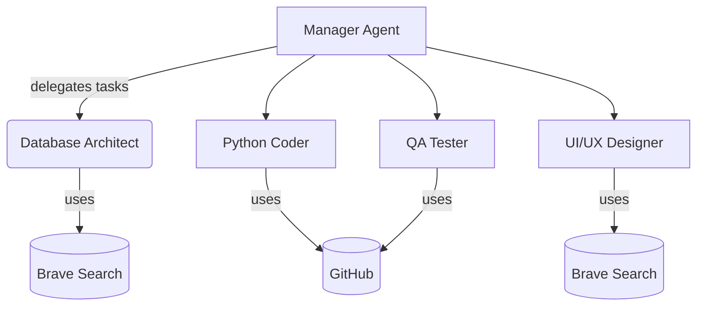
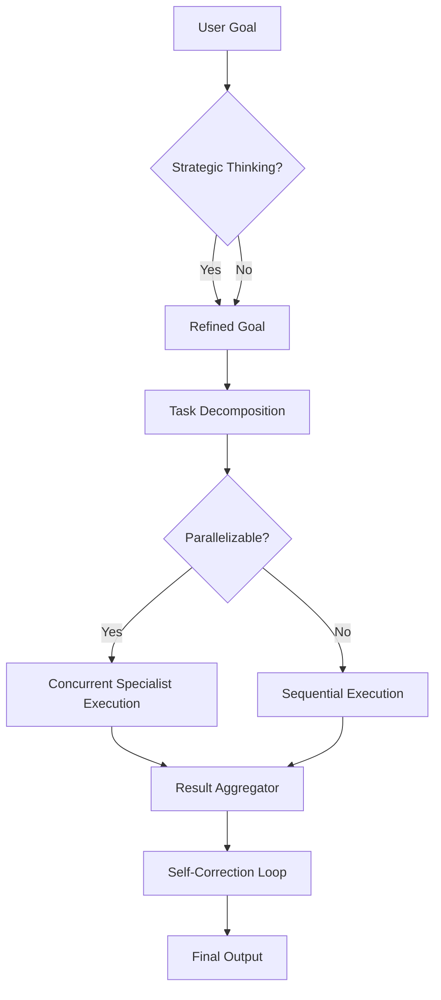

# Agent Committee Playbook

> **Note:** This playbook uses Mermaid diagrams and image placeholders. Replace the placeholder image paths with high-resolution graphics generated by design tools of your choice.

## 1. Architecture Overview

*Figure 1: High-level interaction flow between the Manager Agent, specialists, and tools.*

## 2. Deep Search & Foundational Analysis

**Core Components**
- Manager Agent for planning and reasoning
- Specialist Agents for domain-specific execution
- External tools accessed via CLI (Brave Search, GitHub)

**Strengths**
- Clear role separation
- Reusable command patterns
- Centralized reasoning in Manager Agent

**Top Weaknesses**
1. Limited error recovery when specialists fail
2. Context window limits for complex tasks
3. Sequential bottlenecks when tasks are assigned serially

**Applicable Advanced Concepts**
- **Chain of Thought** for transparent reasoning traces
- **ReAct** for interleaving reasoning and tool use
- **Self-Correction** loops to improve outputs iteratively

## 3. Advanced Decision Frameworks

| Framework | Ideal Use Case | Key Benefit | Scalability Note |
|-----------|----------------|-------------|------------------|
| AutoGen Hierarchical Orchestration | Multi-specialist coordination | Balances speed & accuracy | Scales to ~50 specialists |
| BabyAGI Task Prioritization | Ambiguous goals | Fast execution | Degrades beyond 20 specialists |
| ReAct Strategic Reasoning | High-stakes decisions | Highest accuracy | Slowest; use selectively |
| Cicero Game-Theoretic | Resource negotiation | Fair allocation | High complexity for >20 specialists |
| Voyager Iterative Optimization | Novel problems | Superior error recovery | Handles 100+ specialists |

## 4. Example Command Library

### Manager Agent
1. `gemini-cli "Summarize project roadmap" --tool brave-search`
2. `gemini-cli "List last 5 commits in repo" --tool github`
3. Chain: (a) `gemini-cli "Search best logging libraries" --tool brave-search` → (b) `gemini-cli "Open issue: adopt XYZ logger" --tool github`

### Database Architect
4. `gemini-cli "Research scalable NoSQL options" --tool brave-search`
5. `gemini-cli "Create branch schema-migration" --tool github`

### Python Coder
6. `gemini-cli "Find async API patterns" --tool brave-search`
7. `gemini-cli "Push code to feature/async-support" --tool github`
8. Chain: (a) `gemini-cli "Lookup Python retry libraries" --tool brave-search` → (b) `gemini-cli "Commit retry utility" --tool github`

### UI/UX Designer
9. `gemini-cli "Latest accessibility guidelines" --tool brave-search`
10. Chain: (a) `gemini-cli "Create branch ui-refresh" --tool github` → (b) `gemini-cli "Upload mockups" --tool github`

### QA Tester
11. `gemini-cli "Search flaky test solutions" --tool brave-search`
12. `gemini-cli "Open issue: Intermittent timeout" --tool github`
13. Chain: (a) `gemini-cli "Fetch test coverage" --tool github` → (b) `gemini-cli "Search improve Jest performance" --tool brave-search`

## 5. Proposed New Tools

| Tool | Capability Boost | Example Command |
|------|------------------|-----------------|
| Trello | Project management | `gemini-cli "Add card 'Implement caching layer'" --tool trello` |
| Grafana | System monitoring | `gemini-cli "Query CPU metrics last 24h" --tool grafana` |
| Slack | Team communication | `gemini-cli "Send update to #dev-team" --tool slack` |

## 6. Workflow Innovations

- **Strategic Thinking Mode:** Manager questions initial goals to seek better alternatives.
- **Long-Term Memory:** Store task outcomes to refine future decisions.
- **Parallel Execution:** Assign independent tasks concurrently using async CLI calls.

## 7. Agent Committee v2 Workflow

*Figure 2: Version 2.0 workflow emphasizing strategy, parallelism, and self-correction.*

## 8. Performance & Scalability Snapshot

- ReAct yields highest accuracy (≈96.5%) but at increased latency (~3.8s/task)
- AutoGen balances accuracy and speed, suitable up to ~50 specialists
- Voyager scales to 100+ specialists with strong error recovery

## 9. Conclusion

By integrating advanced reasoning frameworks, parallel execution, and additional tooling, the Agent Committee evolves into a more autonomous and robust system. Use this playbook as a foundation; enhance it with high-resolution diagrams and organization-specific details for maximum impact.

